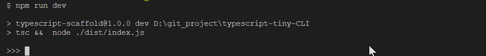

Typescript tiny CLI || 微型命令行 
=

**原理：** 使用nodejs的`readline`库，即可绑定`stdin`获取输入。该库也是事件驱动，监听输入回车的对应事件`line`即可。

运行
--

```sh
npm run dev
```

使用指南
--

输入任意字符并回车，会显示刚刚输入的数据。按`ctrl+c`会显示bye并退出程序。:white_check_mark:



References
--

1. [typescript脚手架](https://github.com/czzonet/typescript-scaffold)
2. [Readline | Node.js v12.10.0 Documentation](https://nodejs.org/api/readline.html)